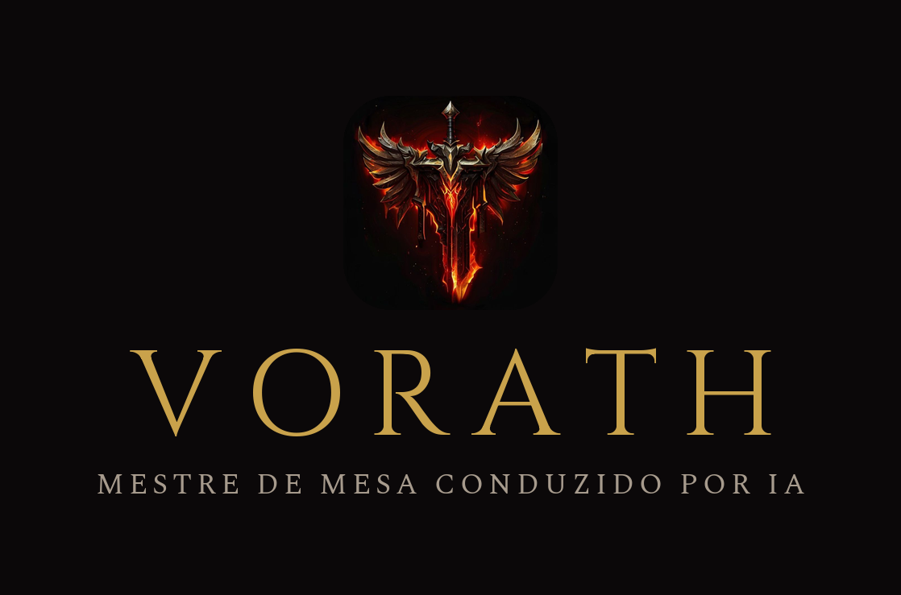
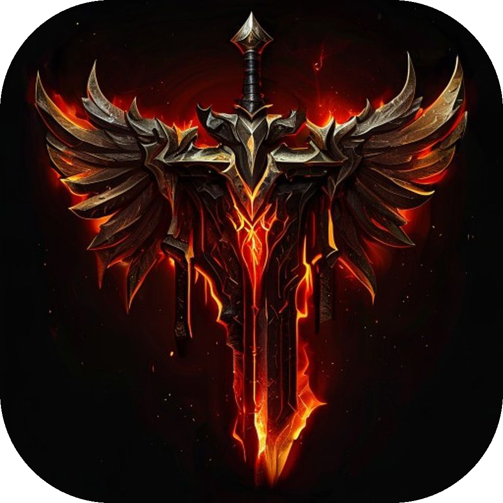
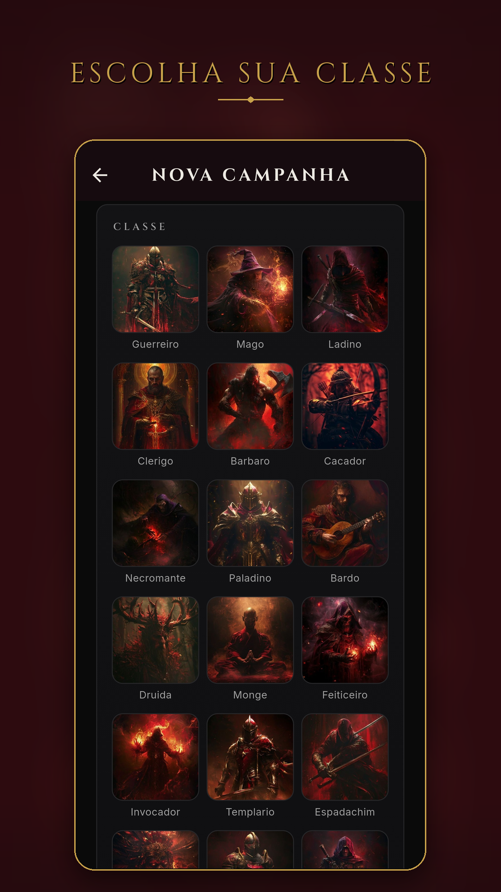
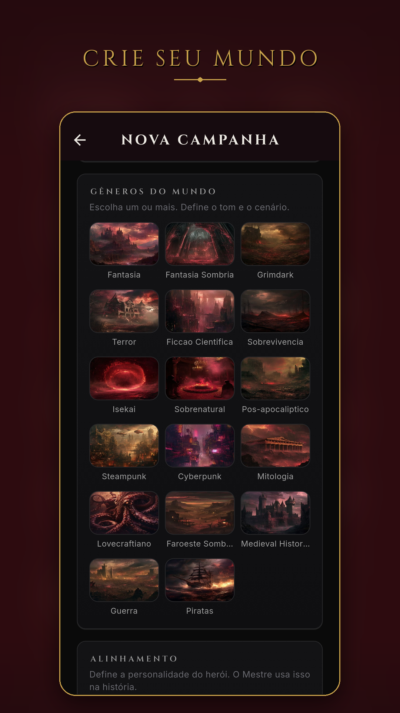
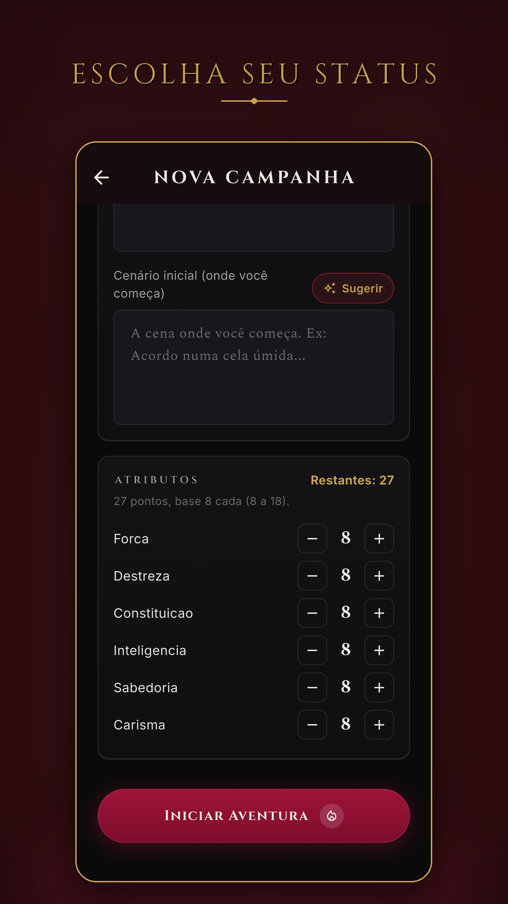

# Vorath RPG

**RPG de mesa solo com um Mestre conduzido por IA — que narra, improvisa e reage a cada escolha sua. O mundo é perigoso, belo e vivo.**

&nbsp;

[-9F1239?style=for-the-badge)](https://github.com/Paulothedeveloper/vorath-releases/releases/latest)

---

Um Mestre de mesa que nunca dorme, nunca falta e nunca repete a mesma história. Você cria um herói, descreve o mundo, e o **Vorath** — o Mestre conduzido por IA — tece uma campanha de fantasia sombria feita só pra você: com dados de verdade, ficha viva, consequências permanentes e um mundo que segue seu próprio rumo enquanto você decide o seu.

Sem marcar mesa. Sem grupo. Sem trilho. Só você, o dado e a escuridão.

## ⚔️ Por que jogar

- **Campanha solo infinita** — nada de fim de roteiro. A história nasce das suas escolhas e continua enquanto você quiser, salva automaticamente. Comece de novo num mundo completamente diferente quando bem entender.
- **Um Mestre que reage de verdade** — o Vorath narra em prosa de grimório, dá voz a NPCs com vontade própria, cobra suas decisões e não tem pena. Escolhas erradas machucam; escolhas espertas viram lenda.
- **26 sistemas de RPG de verdade** — atributos, EXP e nível, **evolução de classe estilo Ragnarök**, craft (ferreiro/alquimista), ouro e comércio, raridade de itens (comum → mítico), runas e aprimoramento +N, magia, sorte/karma/renome, facções (reinos, clãs, religiões, lealdade e traição), missões, eventos aleatórios, maldições e enfermidades.
- **Dados 3D honestos** — o d20 rola na tela, girando de verdade. O Mestre rola sozinho quando a cena exige. Nada de resultado maquiado.
- **Mapa com fog of war** — o mundo se revela conforme você explora. O escuro esconde o que você ainda não teve coragem de enfrentar.
- **Companheiros, pets e montarias** — recrute aliados, crie vínculos, evolua bichos de estimação e montarias que crescem junto com a sua lenda.
- **Combate profundo** — HP/MP/SP/Vigor/CA/Ouro, dano, crítico, descanso, barra de vida dos inimigos, **bosses e mini-bosses**, dungeons e desafios. Loot que os monstros deixam cair.
- **Tudo ilustrado** — classes, raças, gêneros de mundo, habilidades, itens e páginas de cena no estilo livro. Fantasia sombria em vermelho-lava e ouro rúnico, sem um único emoji.

## 🔮 O Sigilo do Mestre

*Uma lâmina de obsidiana coroada de asas e fogo. Onde o sigilo arde, o Mestre observa.*

## 🎲 Como funciona

O Vorath é **grátis pra começar**. Cada palavra do Mestre custa energia — os **tokens** — e você tem várias formas de manter a chama acesa, sem nunca ser obrigado a pagar pra jogar:

- **100 tokens grátis** ao entrar — já dá pra sentir o mundo respirar.
- **+5 tokens** por anúncio assistido (até 5 por dia). Paciência também vira ouro.
- **Pacotes de tokens**, uma compra só, sem assinatura:
  | Pacote | Tokens | Preço |
  |---|---|---|
  | 🔥 Bolsa | 300 | **R$ 4,99** |
  | 🔥 Saco | 1.000 | **R$ 14,99** |
  | 🔥 Baú | 3.000 | **R$ 39,99** |
- **Passe de Mestre** (assinatura), pra quem vive no mundo do Vorath: tokens todo mês, **sem anúncios**, ilustração rápida e brindes premium — **R$ 24,90/mês** ou **R$ 229/ano** (dois meses grátis).

> As ilustrações de cena são geradas **de graça**, sem gastar seus tokens.

## 📜 Veja o Mestre em ação

&nbsp;

&nbsp;

&nbsp;

## 📥 Baixar

O Vorath está em **teste aberto (BETA)** para Android — em breve na Google Play.

➡️ **[Baixar a última versão (APK)](https://github.com/Paulothedeveloper/vorath-releases/releases/latest)**

1. Abra o link acima e baixe o **APK** da última release.
2. Instale no Android (permita instalar de "fontes desconhecidas").
3. Abra, crie seu herói e forje sua lenda. Os primeiros 100 tokens são por conta da casa.

**Saiba mais:** [paulocodex.com/p/vorath](https://paulocodex.com/p/vorath)

## 🗡️ Como se joga

1. **Crie seu herói** — nome, idade, gênero e traços físicos; raça e classe (cada uma ilustrada); alinhamento (14 variações que mudam a história) e 27 pontos de atributo. Sem ideia? Use um preset de história.
2. **Molde o mundo** — escolha os gêneros (fantasia sombria, grimdark, terror, isekai, pós-apocalíptico e mais) e o cenário inicial.
3. **Viva a campanha** — converse com o Mestre, aja, role o dado, gerencie a ficha, explore o mapa, recrute companheiros e enfrente o que a escuridão guarda.
4. **Continue** — várias campanhas em paralelo, tudo salvo automaticamente.

## 👤 Sobre o desenvolvedor

**Paulo Adriel** é produtor de vídeo e desenvolvedor indie brasileiro. Construo o produto **e** a apresentação dele — código + identidade visual, motion e material de lançamento — do zero ao ar em 30 dias. Trabalho de forma aberta e escuto quem usa. Estúdio [**Paulocodex**](https://paulocodex.com).

 

---

📧 [contato@paulocodex.com](mailto:contato@paulocodex.com) &nbsp;·&nbsp; 🌐 [paulocodex.com](https://paulocodex.com) &nbsp;·&nbsp; 📸 [Instagram](https://instagram.com/paulodev.codex) &nbsp;·&nbsp; 💼 [LinkedIn](https://www.linkedin.com/in/paulo-adriel/) &nbsp;·&nbsp; 🐙 [github.com/Paulothedeveloper](https://github.com/Paulothedeveloper)

_Repositório de **apresentação pública** — o código-fonte é fechado. Nada de dado ou segredo aqui._

