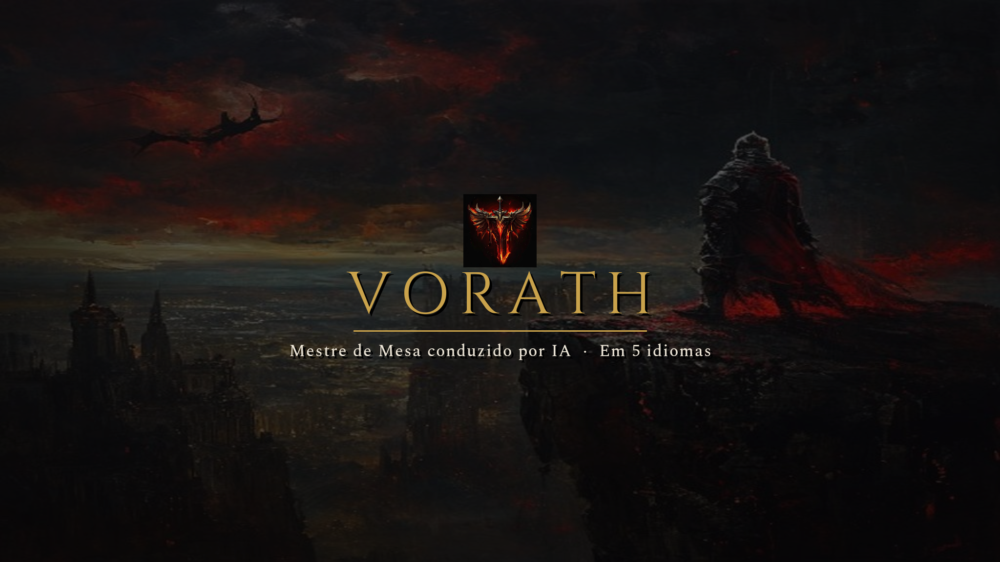
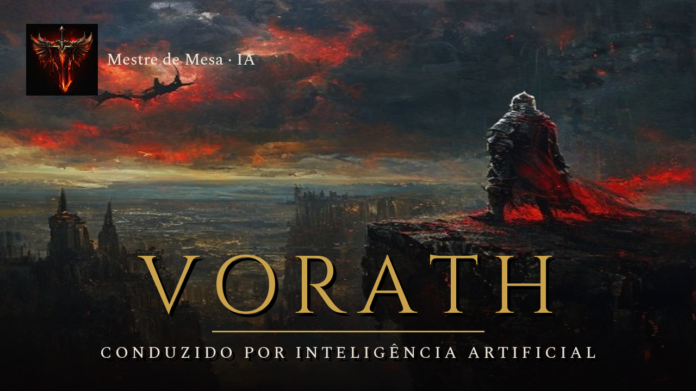
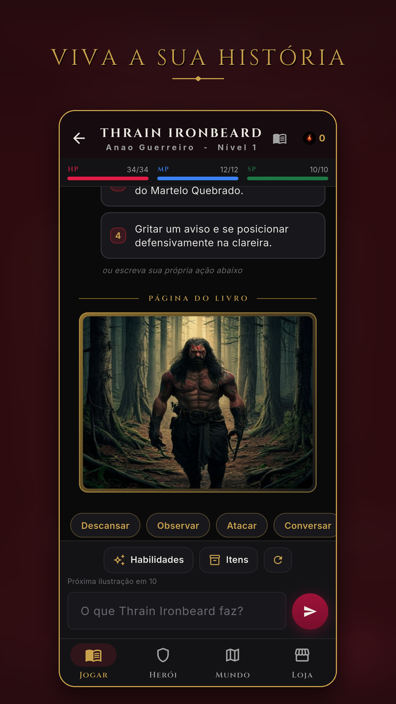
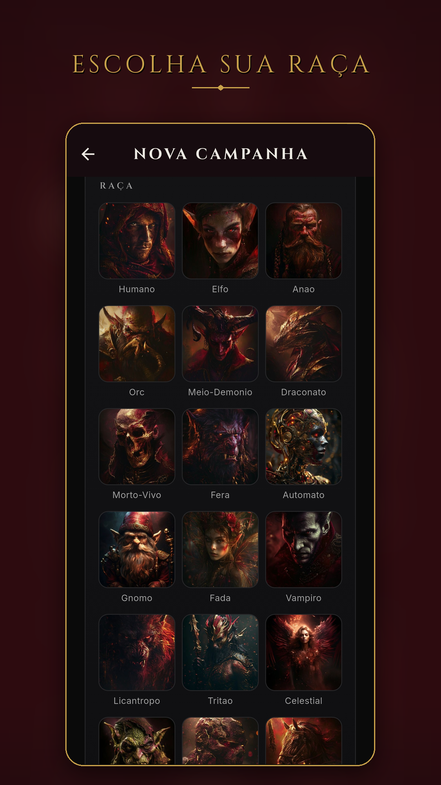
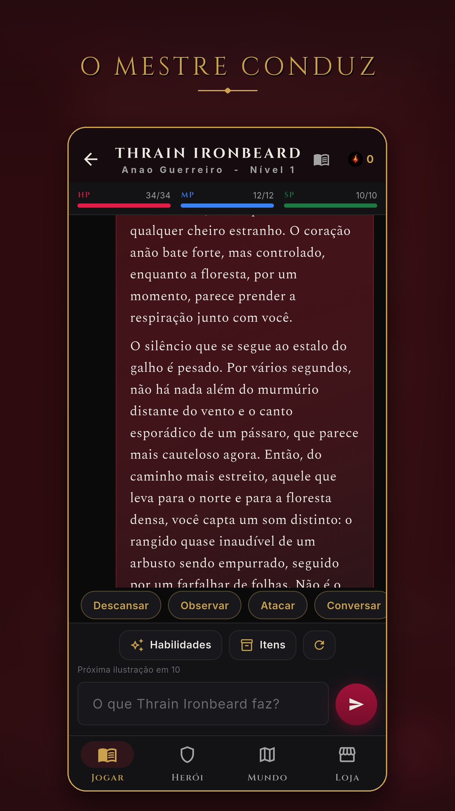
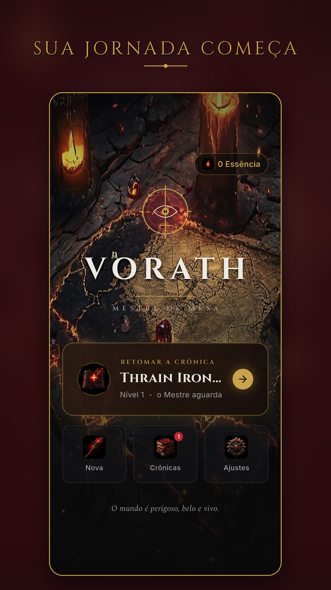

  

<h1 align="center">Vorath RPG — Mestre de Mesa conduzido por IA</h1>

  
  
  
  

> 🚧 **Este projeto está em desenvolvimento ativo.** No momento em **teste fechado** na Google Play — em breve disponível ao público. Esta página apresenta o projeto; o código-fonte é privado.

---

## O que é

**Vorath** é um RPG de mesa **solo** onde a **Inteligência Artificial é o seu Mestre**. Você cria seu herói — raça, classe, mundo — e mergulha numa fantasia sombria onde **cada escolha tem consequência**. O Mestre narra, reage e te desafia; nos momentos de tensão, você **rola o d20** e enfrenta o destino.

## ✦ Destaques

- **Mestre por IA** — narrativa gerada em tempo real, nunca a mesma campanha.
- **Sistema de RPG completo** — atributos, ficha, itens/raridades, habilidades, combate por d20, evolução de classe.
- **Mundo vivo** — mapa, missões, facções e criaturas que reagem a você; companheiros, pets e montarias.
- **Dark fantasy** — identidade cinematográfica (obsidiana, ouro e lava; tipografia Cinzel/Spectral).
- **5 idiomas** — o Mestre narra no seu idioma (PT · EN · ES · FR · DE), com tela de escolha na primeira abertura.

## ▶ Trailer

*(clique para assistir no YouTube)*

## ✦ Telas

  
  
  
  
  

## ✦ Tecnologia

Aplicativo **Android nativo** em **Flutter/Dart** (Material 3), com backend em **Firebase** (Cloud Functions, Firestore, Auth). A geração de narrativa roda **no servidor** — o app nunca expõe chaves. Classificação indicada: **17+**.

## ✦ Links

- 🎬 Trailer: https://youtu.be/UDsYcH6cfBI
- 🔒 Política de Privacidade: https://vorath-8199b.web.app/privacidade
- 📄 Termos de Uso: https://vorath-8199b.web.app/termos
- ✉️ Contato: paulobatista19988@proton.me

---

© 2026 · Vorath RPG · Em desenvolvimento — o código-fonte é mantido em repositório privado.

